# asset-studio

Type a sentence, get a game-ready 3D asset. Everything runs on your own machine — one RTX 5090, Docker Desktop,
no accounts, no uploads, no cloud.

You describe an object ("stylized industrial water pump station, painted teal metal, copper pipes"). asset-studio
paints a reference image, turns it into a high-detail 3D model, then optimizes that model down to the triangle
budget you asked for, bakes the detail into textures, builds LODs and a collision hull, renders previews, and hands
you a folder you can drop straight into Godot, Unity or Blender.

<p align="center">
  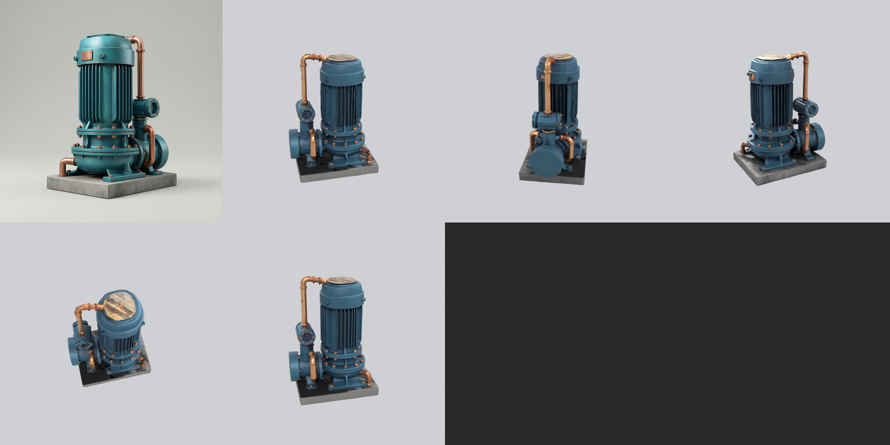
</p>

### From a sentence to a 20k-triangle asset

| Prompt | Reference image the model painted | Optimized asset, rendered |
|---|---|---|
| *"Stylized industrial water pump station, chunky readable silhouette, painted teal metal, copper pipes, small concrete foundation"* | 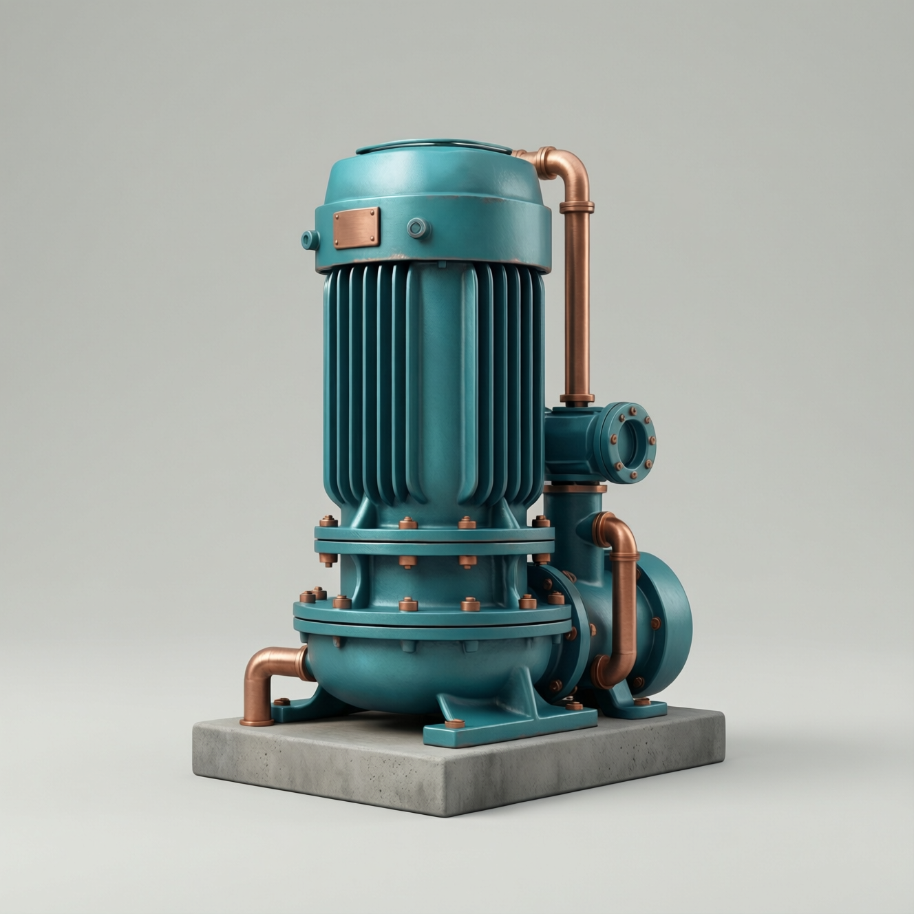 | 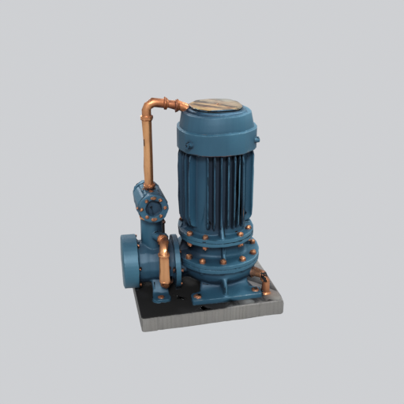<br>19,803 tris, 2048² textures |
| *"Stylized wooden cargo crate with riveted metal corner brackets and a plain diagonal hazard stripe"* | 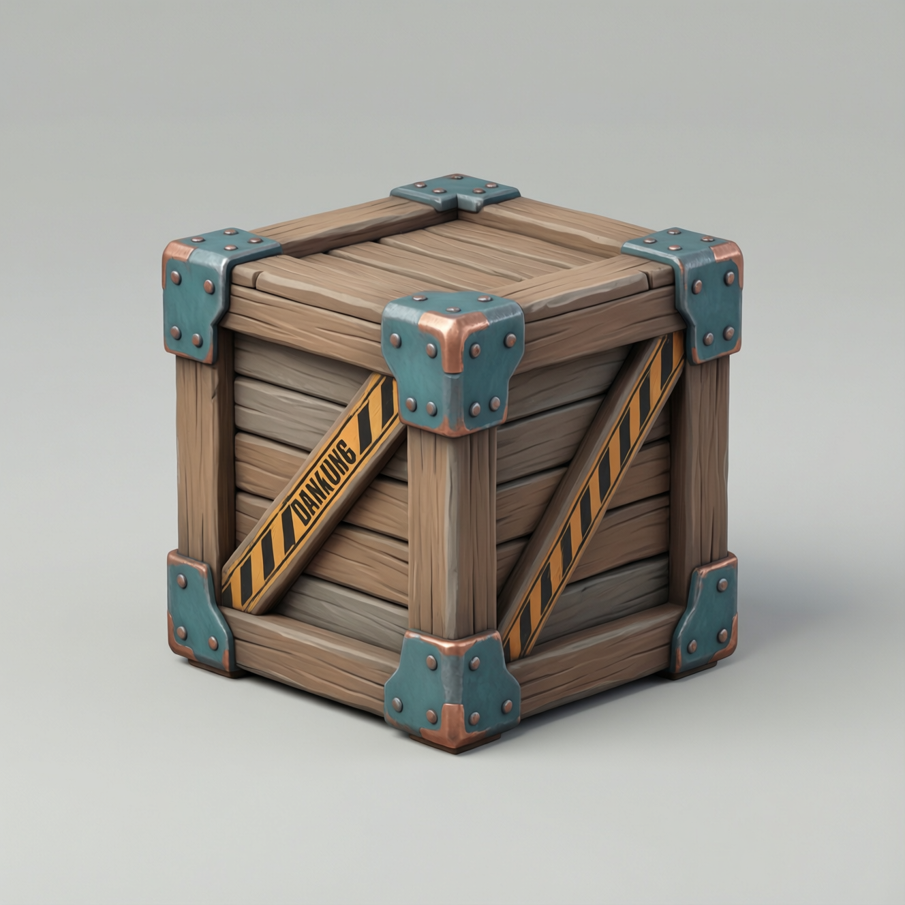 | 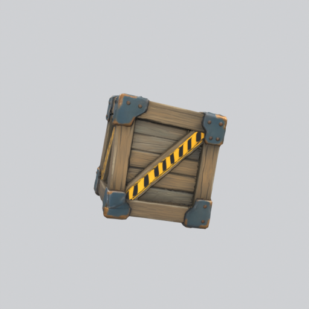<br>7,998 tris, 1024² textures |
| *"Ceramic coffee mug with a wide open handle, glossy teal glaze with a cream interior"* | 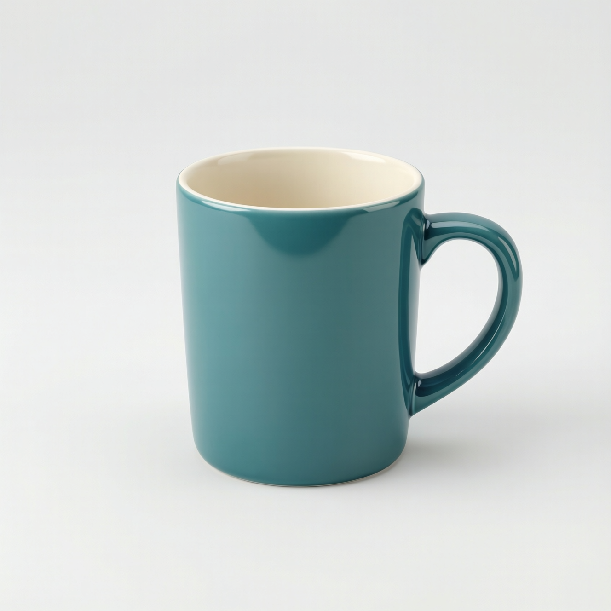 | 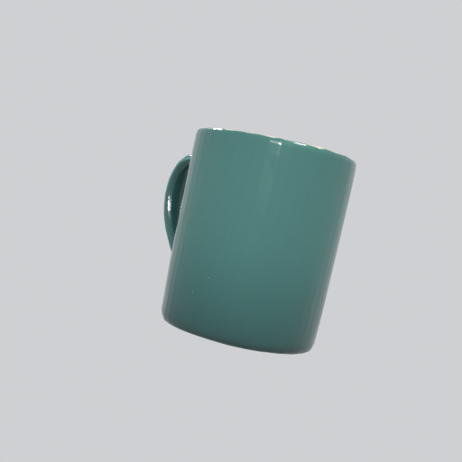<br>6,000 tris, 1024² textures |

Contact sheets for the other two (reference top-left, high-detail master bottom-left, optimized asset elsewhere):

<p align="center">
  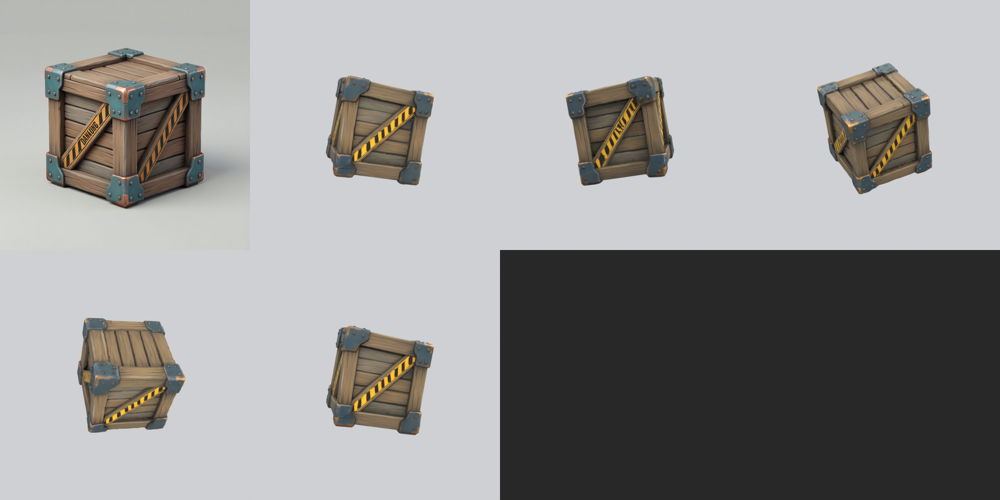
  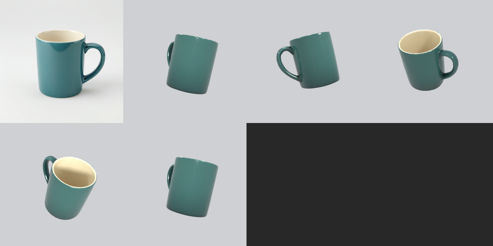
</p>

Every file above is in [`samples/`](samples/), together with the GLBs and the `manifest.json` each job produced.

## What you get

One job produces a folder like this:

| File | What it is |
|---|---|
| `master.glb` | The untouched high-detail model straight out of the 3D generator: up to 1 M triangles, 4096² PBR textures. Keep it for re-optimising later. |
| `<name>.glb` | **The asset you ship.** Reduced to your triangle budget, with base colour, metallic-roughness and normal maps baked from the master. |
| `<name>_LOD1.glb`, `<name>_LOD2.glb` | Lower-detail versions (50 % and 25 % by default), each with its own UVs and smaller bakes. |
| `<name>_collision.glb` | A convex hull of a couple of hundred triangles for the physics engine. |
| `previews/*.png` | Neutral-lit renders: four views of the asset, one of the master, and a contact sheet. |
| `textures/*.png` | The baked maps as loose PNGs, in case you want them outside the GLB. |
| `reference.png` | The reference image the asset was built from. |
| `manifest.json` | What you asked for vs. what actually happened: settings, triangle counts, reduction error, warnings, timings, VRAM/RAM, sha256 of every file. |

Units are metres, glTF Y-up, origin at the bottom centre — so a 2 m pump imports as a 2 m pump.

## Requirements

| | |
|---|---|
| OS | Windows 11 |
| GPU | One NVIDIA RTX 5090 (32 GB). This is what the whole stack is built and tuned for. |
| Docker | Docker Desktop with NVIDIA GPU support (WSL2 backend; the reference machine gives the VM 46 GiB RAM) |
| Disk | About 105 GB of model weights land in a Docker volume — budget ~120 GB free |
| Base image | `trellis2:rtx5090`, built once from the TRELLIS.2 `Dockerfile`. The 3D worker builds on top of it. |

Everything else (CUDA, PyTorch, Blender, the models) lives inside the containers. You do not install Python
packages on the host; the CLI only needs a stock Python 3.

## Quick start

```powershell
scripts\bootstrap.ps1          # once: build images, download the weights, verify they load offline
scripts\start.ps1              # start the service and wait for /health   (scripts\stop.ps1 to stop)
python cli\assetctl.py doctor  # sanity check: GPU, volumes, containers   (--deep also loads the models)
```

Then open **http://127.0.0.1:8090**.

## Web portal

The portal is the friendly way to use asset-studio; it is served by the same container as the API, at
http://127.0.0.1:8090 once `scripts\start.ps1` finishes.

1. **Describe an object.** Type a prompt or click one of the built-in examples (or "Surprise me"), pick a style,
   and choose how many variations you want (4 by default).
2. **Pick the images you like.** You get that many reference-image variations of your idea. Nothing has been built
   in 3D yet, so this stage is cheap to iterate on — reroll, tweak the wording, try another style.
3. **Send them to the queue.** Selected variations become 3D jobs. The queue runs them one at a time on the GPU,
   automatically, or you can park jobs on hold and release them when you want the card free.
4. **Browse the library.** Finished assets show their previews, spin in an in-browser 3D viewer, and download as
   single files or the whole folder. Re-optimise re-runs just the mesh step at a new triangle or texture budget —
   no image or 3D regeneration, so it takes about a minute.

Dark and light themes, and the whole thing is local — the API binds to `127.0.0.1` only.

| Create | Session (pick variations) |
|---|---|
| 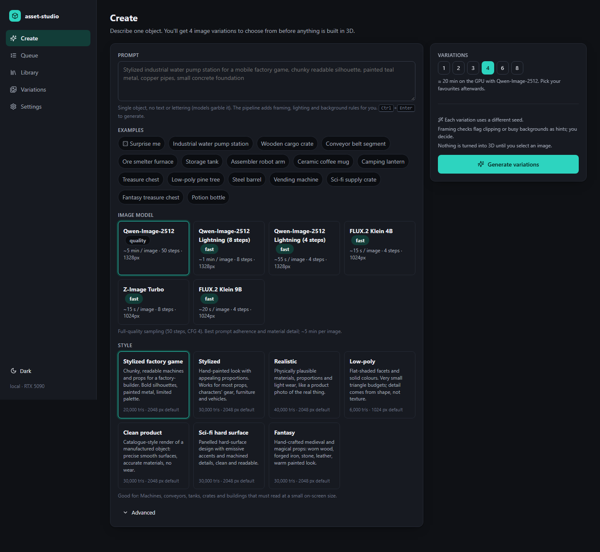 | 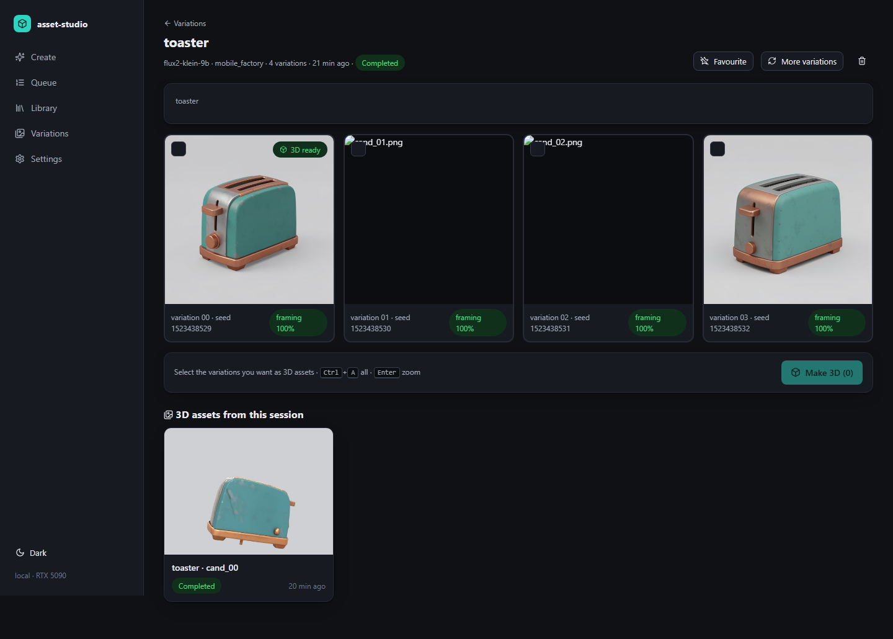 |

| Queue | Library | Asset (3D viewer, stats, downloads) |
|---|---|---|
| 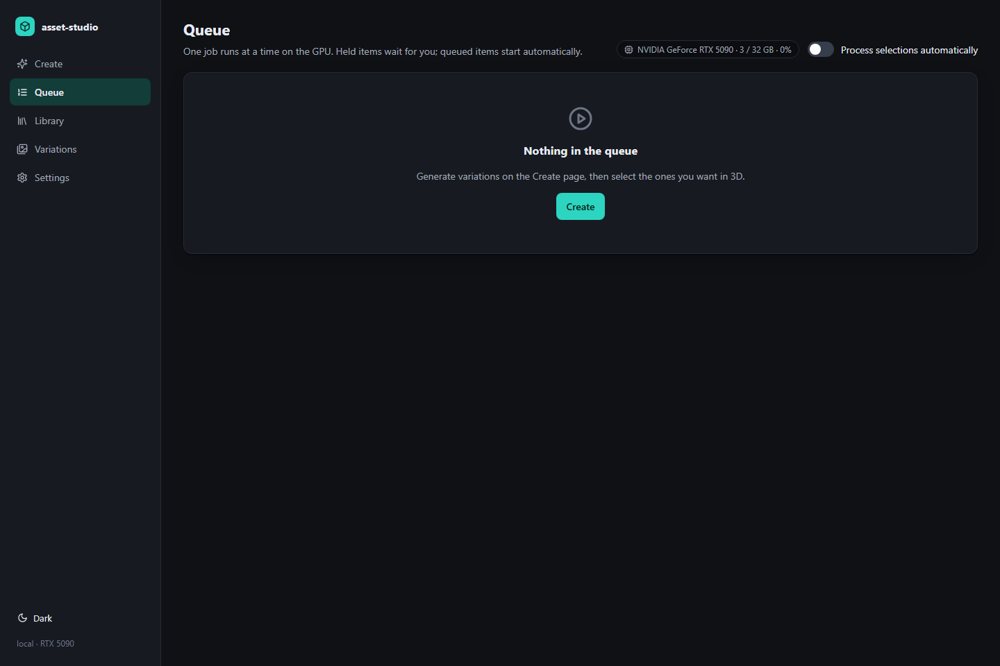 | 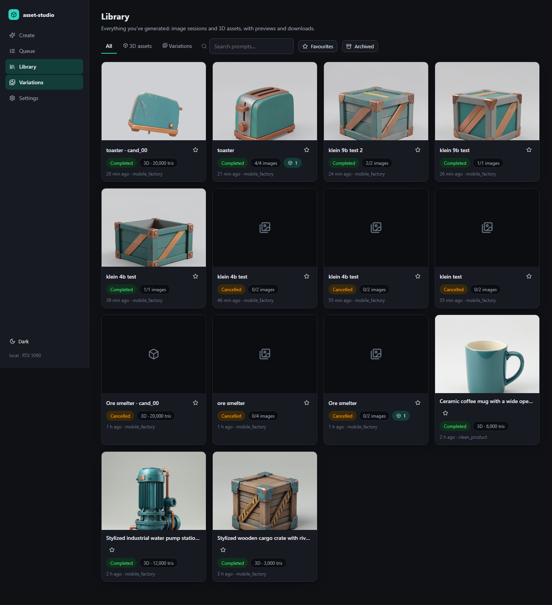 | 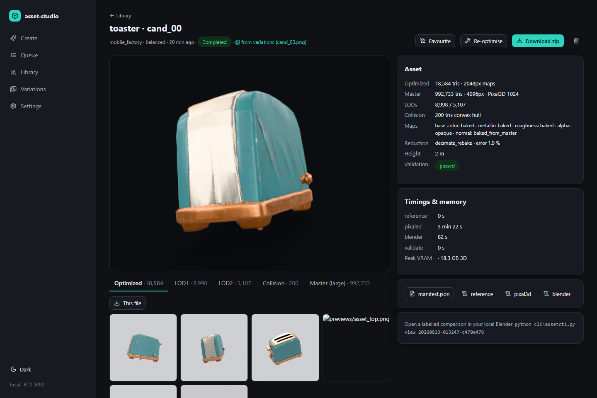 |

Light-theme captures of the same pages are in [`docs/screenshots/`](docs/screenshots/).

### Image models

The reference-image step is the cheap, iterative part, so you can pick the model per session on the Create page
(and set a default in Settings). Everything runs inside the image-worker container with diffusers; the FLUX and
Z-Image weights are read from an existing ComfyUI models folder (`STUDIO_EXTRA_MODELS_DIR` in `.env`) and never
through ComfyUI itself. Times are per image on the RTX 5090 after the model is loaded once per job
(measurements in [`docs/RESULTS.md`](docs/RESULTS.md)).

| Model | Settings | Per image | Notes |
|---|---|---|---|
| **Qwen-Image-2512 Lightning 8** (default) | 1328², 8 steps, no CFG | ~8 s | Won the blind test: best prompt adherence and clean surfaces. fp8 weights fully on the GPU, official Lightning LoRA fused in. Apache-2.0. |
| Qwen-Image-2512 Lightning 4 | 1328², 4 steps, no CFG | ~4 s | Same compositions, thinner detail. Rough iteration. |
| Z-Image Turbo | 1536², 9 steps, guidance 0 | ~9 s | Chunkiest, cleanest silhouettes; second in the blind test. Apache-2.0. |
| FLUX.2 Klein 4B | 1536², 4 steps, guidance 1.0 | ~2.5 s | Fastest. Apache-2.0. |
| FLUX.2 Klein 9B | 1536², 4 steps, guidance 1.0 | ~5 s | FLUX non-commercial licence; gated text encoder downloaded once. |
| Qwen-Image-2512 (50 steps) | 1328², 50 steps, CFG 4 | ~80 s | Undistilled sampling, kept as an option. Rated below Lightning by eye (waxier surfaces). |

The Qwen transformer is built once into an fp8 cache (53 s, 20 GB in the models volume) from the bf16 weights, so the
20B model runs resident on a 32 GB card instead of streaming half of it over PCIe every step (that path took ~5 min per
image). The distilled FLUX models are step- and guidance-distilled, so 4 steps / guidance 1.0 are fixed by the vendor;
resolution is their quality lever, and 1536² was chosen after a sweep. Blind-test details and per-model timings are in
[`docs/RESULTS.md`](docs/RESULTS.md); the benchmark and blind-test scripts are in [`tools/bench/`](tools/bench/).

## Command line

```powershell
python cli\assetctl.py generate "Stylized industrial water pump station with copper pipes" `
   --style mobile_factory --quality quality --seed 12345 --height-m 2.0 --triangles 12000 --texture 2048 `
   --wait --download out\pump
```

Open a finished job in your local Blender as a labelled comparison scene (front row textured: master, optimized,
LODs, collision; back row the same meshes untextured):

```powershell
python cli\assetctl.py view <job_id>            # downloads to out\<job_id> first if needed
python cli\assetctl.py generate "..." --open    # generate, wait, download and open in one go
```

Blender is found via `STUDIO_BLENDER`, `PATH`, or the newest install under `Program Files\Blender Foundation`.

Re-optimise a finished job at a different budget without regenerating anything:

```powershell
python cli\assetctl.py retry <job_id> --from-stage blender --triangles 20000 --texture 2048 --wait
```

Other commands: `status`, `wait`, `download`, `cancel`, `logs`, `list`, `capabilities`, `health`, `doctor`.

## HTTP API

One-shot: prompt in, asset out (`examples/curl_example.sh` does the whole loop).

```bash
curl -X POST http://127.0.0.1:8090/v1/jobs -H 'Content-Type: application/json' -d @examples/pump_station.json
# -> {"job_id": "...", "status": "queued", "status_url": "/v1/jobs/<id>", "artifacts_url": "/v1/jobs/<id>/artifacts"}
curl http://127.0.0.1:8090/v1/jobs/<id>                       # status, stage, progress, warnings, settings, timings, events
curl http://127.0.0.1:8090/v1/jobs/<id>/artifacts             # list what was produced
curl -o asset.glb http://127.0.0.1:8090/v1/jobs/<id>/artifacts/<name>.glb
curl -X POST http://127.0.0.1:8090/v1/jobs/<id>/cancel
curl -X POST http://127.0.0.1:8090/v1/jobs/<id>/retry \
     -H 'Content-Type: application/json' \
     -d '{"from_stage":"blender","optimize":{"target_triangles":20000}}'   # re-optimise, no regeneration
curl http://127.0.0.1:8090/health ; curl http://127.0.0.1:8090/capabilities
```

Two-step (what the portal uses): make images first, choose, then build 3D.

```bash
curl -X POST http://127.0.0.1:8090/v1/image-jobs -H 'Content-Type: application/json' \
     -d '{"prompt":"stylized copper water tank","style":"mobile_factory","variations":4}'
# poll /v1/jobs/<image_job_id> until completed, look at the candidates, then:
curl -X POST http://127.0.0.1:8090/v1/asset-jobs -H 'Content-Type: application/json' \
     -d '{"image_job_id":"<id>","candidate":"cand_02.png","hold":false}'   # hold=true parks it in the review queue
```

Ready-made request bodies: [`examples/pump_station.json`](examples/pump_station.json),
[`examples/cargo_crate.json`](examples/cargo_crate.json), [`examples/mug.json`](examples/mug.json).
`GET /capabilities` returns the full JSON schema of a request. To reach the API from another machine set
`STUDIO_BIND` **and** `STUDIO_API_TOKEN` — the server refuses to start on a non-loopback address without a token.

## MCP server (use it from an agent)

```powershell
pip install "mcp>=1.2"
python mcp\server.py
# Claude Code:  claude mcp add asset-studio -- python C:/Users/Zorro/asset-studio/mcp/server.py
```

Tools: `capabilities`, `generate`, `status`, `wait`, `artifacts`, `download`, `manifest`, `cancel`, `retry`,
`open_in_blender`.

## Styles and quality

Styles ([`presets/styles.yaml`](presets/styles.yaml)) set the look and sensible budget defaults:

| Style | Look | Default triangles / texture |
|---|---|---|
| `mobile_factory` | Chunky readable forms for a mobile factory-builder: strong silhouettes, painted metal, limited palette, no tiny greebles | 20,000 / 2048 |
| `stylized_generic` | General stylized game asset, hand-painted PBR, moderate detail | 30,000 / 2048 |
| `realistic` | Realistic prop, plausible materials and proportions | 40,000 / 2048 |
| `lowpoly` | Flat-shaded facets, solid colours, simple forms | 6,000 / 1024 |
| `clean_product` | Clean product-visualisation look, precise surfaces, white background | 30,000 / 2048 |
| `scifi` | Hard-surface sci-fi: clean panel lines, machined metal, a few emissive accents | 30,000 / 2048 |
| `fantasy` | Hand-crafted fantasy props: worn wood, forged iron, stone, leather, warm painted look | 30,000 / 2048 |

Every style is editable in the portal: pick a card, press **Edit this style**, and change the look sentence, background,
keep-out list and budgets. Edits are saved per style in the app's settings (SQLite) and sent with each job as
`custom_style`; **Reset to preset** brings the original back. The dashed **Custom** card is a style written from scratch.
The API takes the same thing: `"style": "custom"` with a `custom_style.style_clause`, or a preset id plus a partial
`custom_style` to override only some fields.

Quality ([`presets/quality.yaml`](presets/quality.yaml)) decides how much GPU time to spend:

| Quality | Reference images | 3D resolution | Typical wall clock |
|---|---|---|---|
| `balanced` | 1 candidate | 1024 cascade | ~11 min |
| `quality` | 2 candidates | 1536 cascade | ~16 min (about 20 min end to end with two candidates) |

Both export a
1 M-triangle / 4096² master; the image model is chosen separately (table above). You can always override `target_triangles`, `texture_size`, `height_m`, LOD fractions
and collision budget per request.

## How it works

```
prompt ─► reference image (Qwen-Image-2512) ─► 3D model (Pixal3D / TRELLIS.2) ─► master GLB
      ─► Blender: scale, origin, cleanup, meshoptimizer reduction, bake from the untouched master,
         LODs, collision hull, previews ─► validation ─► manifest.json
```

* **Reference image.** Your prompt is rewritten into a single-object, plain-background, three-quarter, soft-lit,
  no-text prompt (plus a strong negative prompt) and rendered by Qwen-Image-2512. In `quality` mode two candidates
  are made and scored by transparent technical checks — background plainness, framing margins, clipping, centring.
* **3D model.** Pixal3D (TRELLIS.2 backbone) mattes and crops the image, estimates the camera, and generates the
  mesh. The export is ours: your own decimation target and texture size, PNG textures instead of WebP.
* **Blender.** Imports the master and never modifies it. Scales to `height_m`, puts the origin at the bottom
  centre, removes loose debris, then reduces to your budget with **meshoptimizer** — the same simplifier behind
  gltfpack and the Unity/Unreal plug-ins — within an error bound that is relaxed step by step only if the budget
  cannot be met. The result gets fresh UVs, and colour/metallic/roughness/normal are baked from the untouched
  master with Cycles, so detail you lose in geometry comes back in the maps. Then LODs, convex collision hull, and
  Cycles preview renders.
* **Validate and package.** Every GLB is inspected (primitives, triangle and vertex counts, UVs, normals, texture
  slots and mime types, bounds, height, origin, budgets) and everything is written into `manifest.json` with a
  sha256 per file.

Practical behaviour worth knowing:

* **Fully offline.** Weights are prefetched once into a Docker volume; the workers run with `HF_HUB_OFFLINE=1`
  and have been verified with `docker run --network none`.
* **One job at a time on the GPU.** Each stage is a fresh subprocess, so CUDA memory is always released between
  stages (that is why a job pays ~52 s of model loading once).
* **It shares the GPU politely.** If another application (ComfyUI, a Blender viewport, a game) is using the card,
  the worker waits instead of killing anything, and on CUDA out-of-memory it waits for memory to free before it
  touches your quality settings.
* **Jobs are durable.** They live in SQLite; if the worker restarts, the job requeues and completed stages are
  reused instead of re-run.

## Benchmarks

Measured on this machine (RTX 5090 32 GB, driver 616.92), from the sample manifests — full detail in
**[BENCHMARKS.md](BENCHMARKS.md)** and the narrative in [`docs/RESULTS.md`](docs/RESULTS.md).

| Asset | Preset | Reference | 3D | Blender | Total | Master tris → optimized | Error | LOD1 / LOD2 | Collision |
|---|---|---|---|---|---|---|---|---|---|
| crate | balanced (1024) | 339 s | 248 s | 78 s | 11.1 min | 954,901 → 7,998 (voxel proxy) | 1.4 % | 3,997 / 1,996 | 200 |
| pump | quality (1536) | 631 s | 226 s | 80 s | 15.6 min | 997,520 → 19,803 | 2.3 % | 9,813 / 5,227 | 200 |
| mug | balanced (1024) | 347 s | 250 s | 74 s | 11.2 min | 969,785 → 6,000 | 1.4 % | 3,088 / 1,500 | 254 |

Most of the time is the reference image (5.7–6.0 s per step at full quality). Re-optimising an existing job at a new
budget is a Blender-only run: about 80 seconds. All 15 produced GLBs pass the Khronos glTF validator with zero
errors and import into headless Godot 4.7.2.

## Tips

* **No text or lettering.** Ask for a sign and you get garbled glyphs — the models cannot spell. The prompt builder
  already forbids text; describe shapes and materials instead ("plain diagonal hazard stripe", not "a sign saying DANGER").
* **One object per prompt.** The pipeline builds a single object on a plain background. A scene, a pair of things, or
  an object on a base plate will confuse the matting step.
* **Budgets:** 3,000–8,000 triangles is a comfortable mobile prop; 20,000 keeps visible mechanical detail; going much
  higher mostly buys silhouette precision you will not see.
* **`height_m` is real-world size** in metres, applied as a uniform scale with the origin at the bottom centre. Set it
  and your asset imports at the right size in the engine.
* **Re-optimise instead of regenerating.** Once you have a master you like, retry from the `blender` stage with a new
  triangle or texture budget. It takes a minute and costs no image or 3D generation.
* **Seeds are reproducible.** Same prompt, style, quality and seed gives you the same reference image again.
* **Try `quality` when the silhouette matters.** The 1536 cascade keeps thin pipes and openings that 1024 rounds off.

## Limitations

* The output is an **optimized static prop**: automatic decimation topology, no rig, no animation-friendly edge flow.
* Matting defaults to Pixal3D's upstream `briaai/RMBG-2.0`, which is gated: accept its license on Hugging Face and run the
  prefetch with your token. Without access, set `STUDIO_REMBG_MODEL=ZhengPeng7/BiRefNet` (open drop-in replacement).
* Multi-view input is implemented and statically validated, but the `*_mv` checkpoints (+17 GB) were never downloaded
  and no multi-view job has been run. There is no automatic novel-view generation.
* **Godot 4.7.2 import is tested**; Unity is not installed on this machine, so it is untested here (the GLBs are
  standard, validator-clean glTF).
* No license file yet.

## Project layout

| Path | What |
|---|---|
| `compose.yaml` | 5 services: `api`, `worker` (orchestrator, one GPU slot), `image-worker`, `pixal3d-worker`, `blender` |
| `web/` | React web portal (create → queue → library), served by the API container |
| `services/studio/studio/` | FastAPI app, SQLite job store, pipeline, prompt builder, presets, GLB validator, worker |
| `services/runner/runner.py` | tiny stage runner: one subprocess per stage so CUDA memory is freed on exit |
| `services/image_worker/` | Qwen-Image-2512 reference candidates + technical selection |
| `services/pixal3d_worker/` | Pixal3D adapter (single-image + multi-view), prefetch/verify |
| `services/blender/process_asset.py` | bpy 4.5 LTS post-processing |
| `presets/` | `styles.yaml`, `quality.yaml` (incl. OOM fallback ladders) |
| `cli/assetctl.py` | dependency-free CLI |
| `mcp/server.py` | MCP wrapper with the same actions |
| `scripts/` | `bootstrap.ps1`, `start.ps1`, `stop.ps1`, `prefetch.ps1` |
| `examples/`, `samples/` | request bodies; outputs of real completed jobs |
| `tests/` | `test_api_mock.py` (no GPU) and `acceptance_real.py` (real GPU runs) |
| `docs/`, `BENCHMARKS.md` | measurements, notes, limitations |
| `manifests/dependency-manifest.json` | pinned commits, model revisions, image ids, frozen packages |

Tests:

```powershell
docker compose run --rm --no-deps -v ${PWD}:/src api python -m pytest -q /src/tests/test_api_mock.py
python tests\acceptance_real.py --cancel-test --restart-test     # real GPU runs
```

## Credits

asset-studio is orchestration around other people's models and tools:

* [Pixal3D](https://huggingface.co/TencentARC/Pixal3D) and [TRELLIS.2](https://github.com/microsoft/TRELLIS) — image-to-3D
* [Qwen-Image](https://huggingface.co/Qwen/Qwen-Image-2512) — reference image generation
* [meshoptimizer](https://github.com/zeux/meshoptimizer) — the mesh simplifier
* [MoGe](https://github.com/microsoft/MoGe) — monocular geometry / camera estimation
* [NAF](https://github.com/valeoai/NAF) and [BiRefNet](https://huggingface.co/ZhengPeng7/BiRefNet) — conditioning and matting
* [Blender](https://www.blender.org/) (bpy) — post-processing, baking and previews

## Pinned versions

Everything is pinned in `manifests/dependency-manifest.json`.

| Image | Base | Key pins |
|---|---|---|
| `asset-studio/pixal3d-worker` | `trellis2:rtx5090` (nvidia/cuda 12.8.1, conda py3.11, nvcc 12.9, **torch 2.11.0+cu128**, flash-attn 2.8.3, nvdiffrast 0.4.0, CuMesh, FlexGEMM, o-voxel all built for sm_120) | Pixal3D `master` @ `f7cf384` (not the `paper` branch), **NATTEN 0.21.0** compiled with `NATTEN_CUDA_ARCH=12.0` (libnatten cutlass-fna verified on the 5090), utils3d 0.0.2 wheel specified by Pixal3D, MoGe @ `74fbce0`, transformers 4.57.3, diffusers 0.37.1 |
| `asset-studio/image-worker` | python 3.11 slim | torch 2.11.0+cu128, diffusers 0.40.0, transformers 5.17.0, accelerate 1.15.0 |
| `asset-studio/blender` | python 3.11 slim | bpy 4.5.13 (Blender 4.5 LTS), meshoptimizer 0.2.30a0 (bound with explicit argtypes), fast-simplification (fallback), trimesh, pygltflib |
| `asset-studio/studio` | python 3.12 slim | fastapi, uvicorn, pydantic, httpx, pygltflib (no CUDA) |

Models (Hugging Face, pinned revisions, cached in the `studio-models` volume): `Qwen/Qwen-Image-2512`,
`TencentARC/Pixal3D` (single-view checkpoints; `*_mv` optional), `Ruicheng/moge-2-vitl`,
`camenduru/dinov3-vitl16-pretrain-lvd1689m`, `briaai/RMBG-2.0` (gated) or `ZhengPeng7/BiRefNet`, plus `valeoai/NAF` (torch.hub, pinned commit).
